# 🧠 TradeKnowledge System Knowledge Graph Visualization


## 📊 **Visual Knowledge Graph Architecture**

```mermaid
graph TB
    %% Core User & Context
    subgraph "👤 User Context"
        U[Scott - Primary User]
        UP[User Preferences]
        UW[User Workflow]
        UR[Personal Relationships]
    end
    
    %% MCP Memory System
    subgraph "🧠 MCP Memory System"
        MEM[Memory Server]
        KG[Knowledge Graph]
        ENT[Entities: 10 nodes]
        REL[Relations: 2 connections]
    end
    
    %% SPARC Trio Agents
    subgraph "🤖 SPARC Trio Agents"
        R["🔍 RESEARCHER|Intelligence Synthesizer"]
        M["🧠 MASTERMIND|Strategic Architect"]
        E["⚡ EXECUTOR|Implementation Virtuoso"]
    end
    
    %% Agent Memory & Communication
    subgraph "💾 Agent Memory Systems"
        BB[InfluxDB Blackboard]
        PM[Persistent Memory]
        AC[Agent Communication]
        WM[Working Memory]
        EM[Episodic Memory]
        SM[Semantic Memory]
        PRM[Procedural Memory]
    end
    
    %% Data Storage Systems
    subgraph "🗄️ Data Storage"
        QD["Qdrant Vector DB|tradeknowledge collection|768-dim vectors"]
        CD["ChromaDB|Document Embeddings"]
        KB["Knowledge.db|SQLite Database"]
        FS["File System|Document Storage"]
    end
    
    %% MCP Servers
    subgraph "🔌 MCP Server Ecosystem"
        MCP1[filesystem]
        MCP2[sqlite]
        MCP3[github]
        MCP4[perplexity]
        MCP5[zen-mcp-server]
        MCP6[context7]
        MCP7[sequential-thinking]
        MCP8[memory]
    end
    
    %% Financial Knowledge Domain
    subgraph "💰 Financial Knowledge"
        TK[TradeKnowledge Core]
        SA[Stock Analysis Engine]
        MD[Market Data Integration]
        PA["Premium Analysis|GOOGL, SPX, LQDA"]
        API[Schwab API Integration]
    end
    
    %% External Integrations
    subgraph "🌐 External Systems"
        OLL["Ollama LLM Integration|qwen3:8b, llama2:13b|mixtral:8x7b"]
        LLM["LLMLingua Compression|20x reduction"]
        PR["Prompt Repository|GitHub-like platform"]
        HVS["Hybrid Vectorization System|40-60% compression"]
        LLC["LLMLingua Compression Pipeline|Qwen2.5-Coder"]
    end
    
    %% Academic Paper Processing
    subgraph "📚 Academic Research Processing"
        LPA["LongLLMLingua Paper Analysis|Trading confidence: 80%"]
        APM["Academic Paper Processing|5-stage pipeline"]
        TIE["Trading Intelligence Extraction|HFT optimization"]
        RIB["Research-to-Implementation|Bridge"]
    end
    
    %% FIRE Command System
    subgraph "🔥 FIRE Command System"
        FC[FIRE Command]
        FI["project:fire command"]
        QG["Quality Gates|98% coverage, 90% mutation"]
        HE["Health Endpoints|health, live, ready"]
        STC["SPARC Trio Integration|Context isolation"]
        SWO["Scott's Workflow|Off-grid optimization"]
    end
    
    %% Connections - User Context
    U --> UP
    U --> UW
    U --> UR
    
    %% Connections - Memory System
    U --> MEM
    MEM --> KG
    KG --> ENT
    KG --> REL
    
    %% Connections - SPARC Trio
    R --> BB
    M --> BB
    E --> BB
    BB --> PM
    PM --> WM
    PM --> EM
    PM --> SM
    PM --> PRM
    
    %% Connections - Agent Communication
    R <--> AC
    M <--> AC
    E <--> AC
    AC --> BB
    
    %% Connections - Data Storage
    R --> QD
    M --> CD
    E --> KB
    TK --> QD
    TK --> CD
    TK --> KB
    FS --> KB
    
    %% Connections - MCP Integration
    MCP1 --> FS
    MCP2 --> KB
    MCP3 --> API
    MCP4 --> SA
    MCP5 --> OLL
    MCP6 --> PR
    MCP7 --> R
    MCP8 --> MEM
    
    %% Connections - Financial Domain
    SA --> MD
    SA --> PA
    MD --> API
    TK --> SA
    
    %% Connections - External Systems
    R --> OLL
    M --> LLM
    E --> PR
    R --> HVS
    HVS --> LLC
    LLC --> LLM
    
    %% Connections - Academic Paper Processing
    R --> LPA
    LPA --> APM
    APM --> TIE
    TIE --> RIB
    RIB --> UW
    APM --> LLC
    LPA --> HVS
    HVS --> TK
    
    %% Connections - FIRE System
    FC --> R
    FC --> M
    FC --> E
    FI --> FC
    FC --> QG
    FC --> HE
    FC --> STC
    STC --> HVS
    SWO --> HVS
    SWO --> U
    STC --> R
    STC --> M
    STC --> E
    
    %% Styling
    classDef userNode fill:#e1f5fe,stroke:#01579b,stroke-width:2px
    classDef agentNode fill:#f3e5f5,stroke:#4a148c,stroke-width:2px
    classDef memoryNode fill:#e8f5e8,stroke:#1b5e20,stroke-width:2px
    classDef dataNode fill:#fff3e0,stroke:#e65100,stroke-width:2px
    classDef mcpNode fill:#fce4ec,stroke:#880e4f,stroke-width:2px
    classDef finNode fill:#f1f8e9,stroke:#33691e,stroke-width:2px
    classDef fireNode fill:#ffebee,stroke:#b71c1c,stroke-width:2px
    classDef academicNode fill:#e8eaf6,stroke:#283593,stroke-width:2px
    classDef externalNode fill:#f3e5f5,stroke:#7b1fa2,stroke-width:2px
    
    class U,UP,UW,UR userNode
    class R,M,E agentNode
    class BB,PM,AC,WM,EM,SM,PRM,MEM,KG,ENT,REL memoryNode
    class QD,CD,KB,FS dataNode
    class MCP1,MCP2,MCP3,MCP4,MCP5,MCP6,MCP7,MCP8 mcpNode
    class TK,SA,MD,PA,API finNode
    class FC,FI,QG,HE,STC,SWO fireNode
    class LPA,APM,TIE,RIB academicNode
    class OLL,LLM,PR,HVS,LLC externalNode
```



## 🗃️ **Current Knowledge Graph State**

### **📋 Entities in Memory Graph (26 nodes)**

| Entity | Type | Key Observations |
|--------|------|------------------|
| `user_scott` | user_profile | Primary TradeKnowledge user, active trader, family-oriented |
| `scott_aunt_relationship` | personal_relationship | Deep family bond, demonstrates caring nature |
| `Ollama qwen3:8b Integration Task` | pending_task | Model integration deferred, sophisticated existing system |
| `TradeKnowledge Ollama System` | system_component | Agent trio framework, GPU optimization, 70%+ cost reduction |
| `TradeKnowledge_MCP_Session_State` | technical_session | Zen MCP server configuration, dependency management |
| `User_Personal_Context` | personal_information | Family relationships and personal details |
| `Scott User Workflow` | user_preference | Manual sudo execution preference, security-first approach |
| `Prompt Repository Integration` | project_component | GitHub-like prompt platform, freemium model |
| `User Preferences` | system_requirements | Security requirements for system administration |
| `LLMLingua Documentation` | technical_documentation | 20x compression, GPU requirements, performance metrics |
| `GPU Processing Requirements` | system_requirements | Default to GPU processing, enable acceleration |
| `Bedrock Migration Plan` | future_project | Complete migration strategy to Amazon Bedrock with hybrid approach |
| `LongLLMLingua Research Paper` | academic_research | ACL 2024 paper on prompt compression for LLM optimization |
| `Prompt Compression Technology` | technical_solution | 20x compression with minimal performance loss |
| `Hybrid Vectorization System` | technical_solution | Smart routing between local and OpenAI embeddings |
| `OpenAI Quota Optimization` | cost_optimization | Strategic 1GB quota management with compression |
| `LLMLingua Compression Pipeline` | Academic Paper Processing | Qwen2.5-Coder integration for content compression |
| `SPARC Trio Integration Context` | System Integration | Enhanced workflow with knowledge graph loading |
| `Performance Optimization Metrics` | Performance Data | 40-60% compression ratios with quality preservation |
| `Scott's Workflow Optimization` | User Context | Off-grid development with multi-device synchronization |
| `MCP Fetch Server` | software_tool | Web content fetching with markdown conversion |
| `Financial Datasets MCP Server` | software_tool | Financial data integration with API access |
| `UV Package Manager` | development_tool | Modern Python dependency management |
| `MCP Protocol` | technology_standard | Model Context Protocol for AI tool integration |
| `LongLLMLingua Paper Analysis` | Academic Research Processing | Comprehensive trading relevance analysis |
| `Academic Paper Processing Methodology` | Research Workflow | 5-stage processing pipeline for research papers |
| `Trading Intelligence Extraction` | Financial Application Analysis | Cost optimization for trading systems |
| `Research-to-Implementation Bridge` | Knowledge Translation | Academic research to practical application |

### **🔗 Relationships (22 connections)**
- `user_scott` ➜ `has_relationship` ➜ `scott_aunt_relationship`
- `TradeKnowledge_MCP_Session_State` ➜ `belongs_to` ➜ `User_Personal_Context`
- `LongLLMLingua Research Paper` ➜ `introduces` ➜ `Prompt Compression Technology`
- `Prompt Compression Technology` ➜ `can_optimize` ➜ `TradeKnowledge Ollama System`
- `user_scott` ➜ `should_implement` ➜ `LongLLMLingua Research Paper`
- `Prompt Compression Technology` ➜ `enhances` ➜ `Bedrock Migration Plan`
- `Hybrid Vectorization System` ➜ `implements_insights_from` ➜ `LongLLMLingua Research Paper`
- `Hybrid Vectorization System` ➜ `optimizes_workflow_for` ➜ `user_scott`
- `OpenAI Quota Optimization Strategy` ➜ `is_core_component_of` ➜ `Hybrid Vectorization System`
- `Hybrid Vectorization System` ➜ `enhances` ➜ `TradeKnowledge Ollama System`
- `Hybrid Vectorization System` ➜ `provides_alternative_to` ➜ `Bedrock Migration Plan`
- `Hybrid Vectorization System` ➜ `integrates with` ➜ `LLMLingua Compression Pipeline`
- `Hybrid Vectorization System` ➜ `enhances` ➜ `SPARC Trio Integration Context`
- `LLMLingua Compression Pipeline` ➜ `achieves` ➜ `Performance Optimization Metrics`
- `SPARC Trio Integration Context` ➜ `optimizes` ➜ `Scott's Workflow Optimization`
- `Scott's Workflow Optimization` ➜ `requires` ➜ `Hybrid Vectorization System`
- `Performance Optimization Metrics` ➜ `supports` ➜ `Scott's Workflow Optimization`
- `LongLLMLingua Paper Analysis` ➜ `demonstrates` ➜ `Academic Paper Processing Methodology`
- `Academic Paper Processing Methodology` ➜ `enables` ➜ `Trading Intelligence Extraction`
- `Trading Intelligence Extraction` ➜ `creates` ➜ `Research-to-Implementation Bridge`
- `LongLLMLingua Paper Analysis` ➜ `validates` ➜ `Hybrid Vectorization System`
- `Research-to-Implementation Bridge` ➜ `enhances` ➜ `Scott's Workflow Optimization`
- `Academic Paper Processing Methodology` ➜ `utilizes` ➜ `LLMLingua Compression Pipeline`

## 💾 **Data Storage Analysis**

### **Vector Databases**
```
📊 Qdrant Collections:
├── tradeknowledge/        (768-dimensional vectors, Cosine distance)
└── ws-5759d9ccbd372db0/   (Workspace collection)

📊 ChromaDB:
└── Document embeddings and chunks

📊 Knowledge.db:
└── SQLite database with structured data
```

### **Agent Memory Systems**
```
🧠 Persistent Memory Types:
├── WORKING     → Short-term (hours)
├── EPISODIC    → Events/experiences (days)  
├── SEMANTIC    → Facts/knowledge (months)
├── PROCEDURAL  → Skills/processes (permanent)
└── CONTEXTUAL  → Environment/context (days)
```

## 🔌 **MCP Server Ecosystem**

### **Active MCP Servers (8 total)**
| Server | Purpose | Status |
|--------|---------|--------|
| filesystem | File system access | ✅ Active |
| sqlite | Database operations | ✅ Active |
| github | Git/GitHub integration | ✅ Active |
| perplexity | AI research queries | ✅ Active |
| zen-mcp-server | Multi-model AI support | ⚠️ Needs restart |
| context7 | Documentation queries | ✅ Active |
| sequential-thinking | Advanced reasoning | ✅ Active |
| memory | Knowledge graph | ✅ Active |

## 📈 **Knowledge Flow Architecture**

```
📥 Input Sources:
├── User queries and commands
├── Document ingestion (PDFs, EPUBs)
├── Market data feeds
├── External API integrations
└── Agent collaboration outputs

🔄 Processing Pipeline:
├── RESEARCHER → Intelligence gathering
├── MASTERMIND → Strategic analysis  
├── EXECUTOR → Implementation
├── InfluxDB → Persistent storage
└── Vector DBs → Semantic search

📤 Output Destinations:
├── FIRE command results
├── Knowledge graph updates
├── Vector embeddings
├── Persistent agent memory
└── User interfaces (API, health endpoints)
```

## 🎯 **System Integration Points**

### **FIRE Command Integration**
- **Command**: `/project:fire` → Activates SPARC trio workflow
- **Quality Gates**: 98% coverage, 90% mutation score, 9.8/10 security
- **Health Monitoring**: `/health`, `/health/live`, `/health/ready` endpoints
- **Real-time Status**: Agent coordination and system health

### **Financial Domain Knowledge**
- **Stock Analysis**: GOOGL, SPX, LQDA premium analysis
- **Market Data**: Real-time integration via Schwab API
- **Document Processing**: Academic papers, trading books, research
- **Vector Search**: Semantic search across financial knowledge

### **Agent Collaboration**
- **Blackboard Pattern**: InfluxDB-based inter-agent communication
- **Context Isolation**: Domain-specific expertise without cross-contamination
- **Memory Persistence**: Long-term learning and pattern recognition
- **Performance Tracking**: Optimization and cost efficiency monitoring

## 🔮 **Knowledge Graph Growth Patterns**

### **Current Trends**
- **Personal Context**: Strong emphasis on user preferences and workflow
- **Technical Integration**: Focus on MCP servers and agent coordination
- **Financial Domain**: Growing stock analysis and market data capabilities
- **Quality Systems**: Production-grade testing and health monitoring

### **Growth Opportunities**
- **Cross-entity Relationships**: More connections between technical and financial domains
- **Temporal Patterns**: Time-series knowledge evolution tracking
- **Domain Expansion**: Additional financial instruments and analysis types
- **Agent Learning**: Capture more procedural knowledge from successful workflows

---

**🧠 Knowledge Graph Status**: **Healthy & Growing**
- **26 entities** with rich contextual information across multiple domains
- **22 relationships** showing strong interconnections between systems
- **8 MCP servers** providing diverse data sources and capabilities
- **New academic research processing** pipeline for intelligent paper analysis
- **Advanced compression technology** with 40-60% optimization ratios
- **Multiple storage systems** for different data types and use cases
- **Production-ready** monitoring and health systems with quality gates