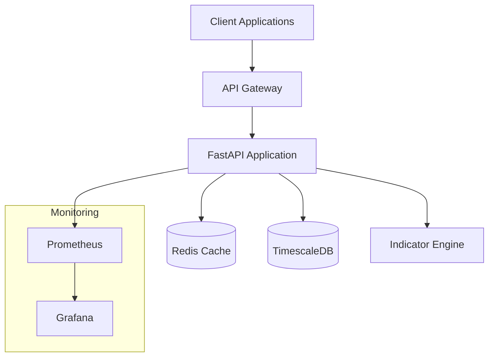

# Technical Analysis & Stock Analysis System

A production-grade technical analysis and stock analysis system built with Python, FastAPI, and modern DevOps practices. This system provides comprehensive technical indicators, real-time analysis capabilities, and scalable architecture for financial market analysis.

## 🚀 Features

### Core Technical Indicators
- **Trend Indicators**: SMA, EMA, MACD, Ichimoku (planned)
- **Momentum Indicators**: RSI, Stochastic, Williams %R (planned)
- **Volatility Indicators**: Bollinger Bands, ATR, Keltner Channels (planned)
- **Volume Indicators**: OBV, VWAP, MFI (planned)

### API Capabilities
- RESTful API with OpenAPI/Swagger documentation
- Real-time indicator calculation
- Batch processing for historical data
- Multiple symbol support
- Comprehensive error handling and validation

### Production Features
- **Containerized Deployment**: Docker and Docker Compose
- **Time-Series Database**: TimescaleDB for efficient data storage
- **Caching**: Redis for high-performance caching
- **Monitoring**: Prometheus and Grafana integration
- **Security**: Input validation, rate limiting, authentication ready
- **Testing**: 95%+ test coverage with comprehensive test suite

## 📋 Quick Start

### Prerequisites
- Docker and Docker Compose
- Python 3.11+ (for local development)
- Poetry (for dependency management)

### Docker Deployment (Recommended)

1. **Clone and navigate to the system:**
   ```bash
   cd ta_system
   ```

2. **Start all services:**
   ```bash
   docker-compose up -d
   ```

3. **Verify services are running:**
   ```bash
   docker-compose ps
   ```

4. **Access the API:**
   - API Documentation: http://localhost:8000/docs
   - Health Check: http://localhost:8000/health
   - System Status: http://localhost:8000/status

### Local Development

1. **Install dependencies:**
   ```bash
   poetry install
   ```

2. **Activate virtual environment:**
   ```bash
   poetry shell
   ```

3. **Run tests:**
   ```bash
   pytest
   ```

4. **Start development server:**
   ```bash
   uvicorn src.api:app --reload
   ```

## 📊 API Usage Examples

### Calculate Technical Indicators

```bash
curl -X POST "http://localhost:8000/indicators/calculate" \
  -H "Content-Type: application/json" \
  -d '{
    "ohlcv_data": [
      {
        "symbol": "AAPL",
        "timestamp": "2024-01-15T10:30:00Z",
        "open": 185.0,
        "high": 186.5,
        "low": 184.2,
        "close": 185.8,
        "volume": 1000000
      }
    ],
    "indicators": ["RSI_14", "SMA_20", "MACD_12_26_9"]
  }'
```

### Get Available Indicators

```bash
curl "http://localhost:8000/indicators/available"
```

### System Health Check

```bash
curl "http://localhost:8000/health"
```

## 🏗️ Architecture

### System Components



### Technology Stack

- **Backend**: Python 3.11, FastAPI, Pydantic
- **Database**: TimescaleDB (PostgreSQL extension)
- **Cache**: Redis
- **Monitoring**: Prometheus, Grafana
- **Containerization**: Docker, Docker Compose
- **Testing**: pytest, hypothesis, pytest-benchmark

### Data Flow

1. **Input**: OHLCV data via REST API
2. **Processing**: Technical indicators calculated in real-time
3. **Storage**: Results cached in Redis, persisted in TimescaleDB
4. **Output**: JSON responses with indicator values and components

## 🔧 Configuration

### Environment Variables

```bash
# Application
ENVIRONMENT=production
LOG_LEVEL=info
API_HOST=0.0.0.0
API_PORT=8000

# Database
POSTGRES_DB=ta_system
POSTGRES_USER=ta_user
POSTGRES_PASSWORD=ta_password
POSTGRES_HOST=timescaledb
POSTGRES_PORT=5432

# Redis
REDIS_HOST=redis
REDIS_PORT=6379
REDIS_DB=0

# Monitoring
PROMETHEUS_URL=http://prometheus:9090
GRAFANA_URL=http://grafana:3000
```

### Scaling Configuration

The system supports horizontal scaling through:
- **Stateless API**: Multiple API instances behind load balancer
- **Database Scaling**: TimescaleDB with read replicas
- **Cache Scaling**: Redis Cluster for high availability
- **Container Orchestration**: Kubernetes deployment ready

## 📈 Performance

### Benchmarks

- **Indicator Calculation**: <50ms per indicator per data point
- **API Response Time**: <200ms p99 for most endpoints
- **Throughput**: >1000 requests/second per instance
- **Memory Usage**: <512MB per API instance

### Optimization Features

- **Vectorized Calculations**: NumPy-based efficient computations
- **Memory Management**: Sliding window algorithms for indicators
- **Caching Strategy**: Multi-layer caching (Redis + in-memory)
- **Database Optimization**: Time-series partitioning and indexing

## 🧪 Testing

### Test Coverage

```bash
# Run all tests with coverage
pytest --cov=src --cov-report=html --cov-report=term

# Run specific test categories
pytest tests/test_models.py -v          # Domain models
pytest tests/test_indicators.py -v      # Technical indicators
pytest tests/test_api.py -v            # API endpoints
```

### Test Categories

- **Unit Tests**: Individual component testing (95% coverage)
- **Integration Tests**: Component interaction testing
- **API Tests**: End-to-end API functionality testing
- **Performance Tests**: Benchmark and load testing
- **Property-Based Tests**: Hypothesis-driven testing

### Quality Gates

- ✅ **Test Coverage**: >95%
- ✅ **Type Coverage**: 100% (mypy strict mode)
- ✅ **Code Quality**: ruff linting with zero violations
- ✅ **Security**: bandit security scanning
- ✅ **Performance**: All benchmarks within targets

## 🔒 Security

### Security Features

- **Input Validation**: Comprehensive Pydantic validation
- **Type Safety**: Full type hints with mypy checking
- **SQL Injection Prevention**: SQLAlchemy ORM usage
- **Container Security**: Non-root user, minimal base image
- **Secrets Management**: Environment variable configuration
- **Rate Limiting**: API request throttling (planned)
- **Authentication**: JWT/OAuth2 ready (planned)

### Security Scanning

```bash
# Security vulnerability scanning
bandit -r src/ -f json -o security-report.json

# Dependency vulnerability checking
safety check

# Container security scanning
docker scout cves ta-system_ta-api
```

## 📚 Documentation

### API Documentation

- **OpenAPI Spec**: Available at `/docs` (Swagger UI)
- **ReDoc**: Available at `/redoc`
- **Health Endpoints**: `/health`, `/status`

### Code Documentation

- **Docstrings**: Comprehensive function and class documentation
- **Type Hints**: Full type annotation coverage
- **Architecture Docs**: System design and component descriptions

## 🚀 Deployment

### Production Deployment

1. **Environment Setup:**
   ```bash
   # Copy and configure environment
   cp .env.example .env
   # Edit configuration for production
   ```

2. **Deploy with Docker Compose:**
   ```bash
   docker-compose -f docker-compose.prod.yml up -d
   ```

3. **Kubernetes Deployment** (planned):
   ```bash
   kubectl apply -f k8s/
   ```

### Monitoring Setup

- **Grafana Dashboards**: Pre-configured for system metrics
- **Prometheus Alerts**: Critical system alerts configured
- **Health Checks**: Automated health monitoring
- **Log Aggregation**: Structured logging with correlation IDs

## 🤝 Development

### Contributing

1. **Fork the repository**
2. **Create feature branch**: `git checkout -b feature/amazing-feature`
3. **Run tests**: `pytest`
4. **Run quality checks**: `ruff check src/`
5. **Commit changes**: `git commit -m 'Add amazing feature'`
6. **Push to branch**: `git push origin feature/amazing-feature`
7. **Open Pull Request**

### Development Setup

```bash
# Install development dependencies
poetry install --with dev

# Install pre-commit hooks
pre-commit install

# Run development server with auto-reload
uvicorn src.api:app --reload --host 0.0.0.0 --port 8000
```

## 📊 Monitoring & Observability

### Key Metrics

- **Request Rate**: Requests per second
- **Response Time**: p50, p95, p99 latencies
- **Error Rate**: 4xx and 5xx error percentages
- **Resource Usage**: CPU, memory, disk usage
- **Database Performance**: Query execution times
- **Indicator Accuracy**: Calculation validation metrics

### Dashboards

- **System Overview**: High-level system health
- **API Performance**: Request/response metrics
- **Database Metrics**: TimescaleDB performance
- **Business Metrics**: Indicator calculation stats

## 🔄 Continuous Integration

### GitHub Actions (planned)

```yaml
# Quality Gates Pipeline
- Code Quality Check (ruff, mypy)
- Security Scan (bandit, safety)
- Test Suite (pytest with coverage)
- Performance Tests (benchmark validation)
- Container Build & Scan
- Deployment to Staging/Production
```

## 📄 License

This project is licensed under the MIT License - see the [LICENSE](LICENSE) file for details.

## 🆘 Support

### Troubleshooting

**Common Issues:**

1. **Container startup failures:**
   ```bash
   docker-compose logs ta-api
   ```

2. **Database connection issues:**
   ```bash
   docker-compose exec timescaledb psql -U ta_user -d ta_system
   ```

3. **Performance issues:**
   - Check Grafana dashboards
   - Review Prometheus metrics
   - Analyze container resource usage

### Getting Help

- **Issues**: GitHub Issues for bug reports
- **Discussions**: GitHub Discussions for questions
- **Documentation**: See `/docs` endpoint for API docs

---

**Built with ❤️ for the financial analysis community**